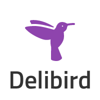

# Delibird

[](https://godoc.org/github.com/purpleworks/delibird)
[](http://goreportcard.com/report/purpleworks/delibird)
[](https://coveralls.io/r/purpleworks/delibird)
[](https://travis-ci.org/purpleworks/delibird)

[](https://heroku.com/deploy?template=https://github.com/purpleworks/delibird)

<p align="center">

</p>

Delibird is a shipment tracking library for Golang.

Delibird는 택배사의 배송조회 페이지를 파싱하여 정형화된 형태로 바꿔주는 라이브러리입니다.

## Courier List

지원하는 택배사 목록입니다.

Name | Contributor
---- | ----
Korean Post / 우체국택배 | @purpleworks
CJ KoreaExpress / CJ대한통운 | @purpleworks
KG Logis / KG로지스 | @serendip811

## Installation

```
$ go get github.com/purpleworks/delibird
```

## Usage

### Code

```
package package_name

import "github.com/purpleworks/delibird"
import "github.com/purpleworks/delibird/couriers"

func GetCjTracking(n string) {
	courier, _ := couriers.New("CJ")
	data, _ := courier.Parse(n)

	fmt.Println("%s -> %s : %s", data.Sender, data.Receiver, data.StatusText)
}
```

### API Server

Build and run API server:

```
$ ./build
$ bin/delibird_server
```

or

```
$ PORT=8080 bin/delibird_server
```

Server Configuration

- ENVIRONMENT: development or production(optimize json output) (default development)
- PORT: server port (default 9000)
- ENABLE_CORS: enable cors if true (default false)

**Request URL**

- local: http://localhost:9000/tracking/{COURIER_CODE}/{TRACKING_NUMBER}
- try now: https://delibird.herokuapp.com/tracking/{COURIER_CODE}/{TRACKING_NUMBER}
- swagger ui: [http://petstore.swagger.io](http://petstore.swagger.io/?url=https%3A%2F%2Fraw.githubusercontent.com%2Fpurpleworks%2Fdelibird%2Fmaster%2FDocument%2Fswagger.json#!/default/get_tracking_code_tracking_number)

**Request Parameters**

COURIER_CODE

Code | Name
---- | ----
KPOST | Korean Post / 우체국택배
CJ | CJ Korea express / CJ대한통운
KG | KG Logis / KG로지스

**Response**

Key | Description | Example
---- | ---------- | ----
TrackingNumber | 송장번호 | 1234567890123
CompanyCode | 택배사코드 | KPOST, CJ, ...
CompanyName | 택배사명 | CJ대한통운
Sender | 보내는분 | 홈*럼
Receiver | 받는분 | 테*트
Signer | 수령인 | 본인
StatusCode | 상태코드 | 하단 참고
StatusText | 상태 | 배송완료
History | 배송 상황(array) | 하단 참고

**Status Code**

- `-1` (UnknownStatus) - 알수없음
- `1` (Pending) - 접수 대기
- `2` (Ready) -  영업점 접수 (SM입고)
- `3` (PickupComplete) - 집화처리
- `4` (Loading) - 간선상차 / 물건 실음 / 중간 집화지 출발
- `5` (Unloading) - 간선하차 / 분류 / 중간 집화지 도착
- `51` (DeleveryStart) - 배송출발
- `91` (DeleveryComplete) - 배송완료
- `99` (DoNotDelevery) - 미배달

**History**

- `Area` - 위치
- `Tel` - 전화번호
- `Date` - 시간(timestamp)
- `DateText` - 시간(YYYY-MM-DD hh:mm)
- `StatusCode` - 상태코드
- `StatusText` - 상태


**Response example**

```
{
  "tracking_number": "xxxxxx",
  "company_code": "CJ",
  "company_name": "CJ대한통운",
  "sender": "홈*럼",
  "receiver": "테*트",
  "signer": "경비실",
  "status_code": 91,
  "status_text": "배달완료",
  "history": [
    {
      "area": "송파B직영(차상문)",
      "tel": "02-6937-6842",
      "date": 1460013885,
      "date_text": "2016-04-07 16:24",
      "status_code": 3,
      "status_text": "집화처리"
    },
    {
      "area": "송파B직영(차상문)",
      "tel": "02-6937-6842",
      "date": 1460013885,
      "date_text": "2016-04-07 16:24",
      "status_code": 2,
      "status_text": "SM입고"
    },
    {
      "area": "송파A",
      "tel": "02-6937-6836",
      "date": 1460026859,
      "date_text": "2016-04-07 20:00",
      "status_code": 4,
      "status_text": "간선상차"
    },
    {
      "area": "용인HUB",
      "date": 1460050614,
      "date_text": "2016-04-08 02:36",
      "status_code": 5,
      "status_text": "간선하차"
    },
    {
      "area": "용인HUB",
      "date": 1460050669,
      "date_text": "2016-04-08 02:37",
      "status_code": 5,
      "status_text": "간선하차"
    },
    {
      "area": "용인HUB",
      "date": 1460050694,
      "date_text": "2016-04-08 02:38",
      "status_code": 4,
      "status_text": "간선상차"
    },
    {
      "area": "용인HUB",
      "date": 1460050750,
      "date_text": "2016-04-08 02:39",
      "status_code": 4,
      "status_text": "간선상차"
    },
    {
      "area": "노원",
      "tel": "02-2129-1278",
      "date": 1460067554,
      "date_text": "2016-04-08 07:19",
      "status_code": 5,
      "status_text": "간선하차"
    },
    {
      "area": "서울서노원",
      "tel": "070-4191-7643",
      "date": 1460068287,
      "date_text": "2016-04-08 07:31",
      "status_code": 51,
      "status_text": "배달출발"
    },
    {
      "area": "서울서노원",
      "tel": "070-4191-7643",
      "date": 1460098645,
      "date_text": "2016-04-08 15:57",
      "status_code": 91,
      "status_text": "배달완료"
    }
  ]
}
```

## Docker

docker build

```
$ DOCKER_BUILD=1 ./build
$ docker build -t purpleworks/delibird .
```

docker run

```
$ docker run --rm \
  -p 9000:9000 \
  -e ENVIRONMENT=production \
  -e ENABLE_CORS=ture \
  purpleworks/delibird
```

## Test

Test with [goconvey](http://goconvey.co/)

```
$ go get github.com/smartystreets/goconvey
```

### In the browser

```
$ goconvey
```

### In the terminal

```
$ go test && go test ./server && go test ./couriers
$ go test -v && go test -v ./server && go test ./couriers # include the story
```

## Contributing

Bug reports and pull requests are welcome on GitHub at https://github.com/purpleworks/delibird

1. Fork it ( https://github.com/purpleworks/delibird/fork )
2. Create your feature branch (git checkout -b my-new-feature)
3. Commit your changes (git commit -am 'Add some feature')
4. Push to the branch (git push origin my-new-feature)
5. Create a new Pull Request

## License

Released under the [MIT License](https://github.com/purpleworks/delibird/blob/master/LICENSE).
